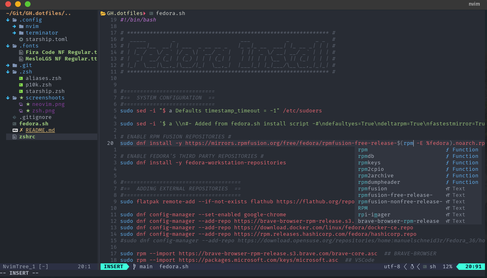
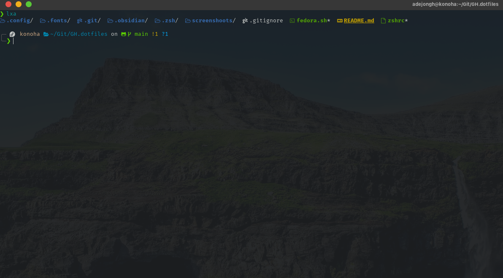
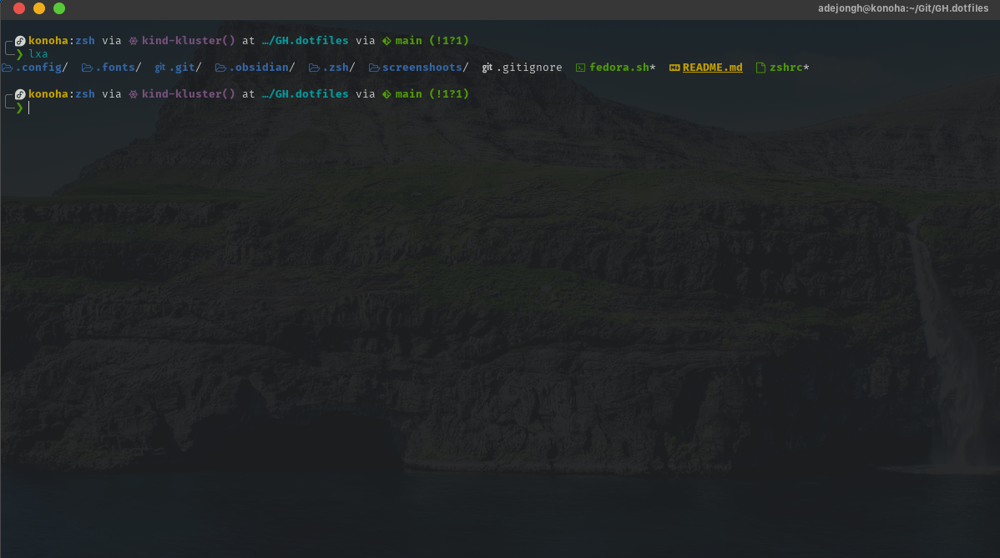

# Configuration Files for Fedora Linux 37 (Xfce)

In this repository are my configuration files for Fedora Linux 37 (Xfce) used on my personal computer. In it, you will find what is necessary to configure [Terminator](https://terminator-gtk3.readthedocs.io/en/latest/), [Zshell](https://www.zsh.org/) with [Oh My Zsh](https://github.com/ohmyzsh/ohmyzsh) and [Powerlevel 10k](https://github.com/romkatv/powerlevel10k), with [Starship](https://starship.rs/) as an alternative. There is also everything you need to set up [Noevim](https://neovim.io/) as your IDE for programming in Python and a few other languages.

Using the following command line, you can enjoy my customizations without spending hours configuring anything. Running it will download the [fedora.sh](fedora.sh) script and run it automatically once the download is complete.

***DISCLAIMER:*** Before running the above command or the fedora script manually, please read de script to understand what it does.

```sh
sh -c "$(curl -fsSL https://raw.githubusercontent.com/adejonghm/dotfiles/main/fedora.sh)"
```

***Recomendation:*** Feel free to use some parts of the configuration files, or if you want, you can fork the repository and make your customizations.

| [Neovim](#neovim-configuration) | [Zshell](#zshell-configuration) | [Starship](#starship-configuration) |
|---------------------------------|---------------------------------|-------------------------------------|

## Neovim configuration

My setup is based on the [Lua language](https://www.lua.org/), and Neovim (version 0.8 or later) is required. The configuration files are [here](.config/nvim).

### Dependencies

- [NPM](https://github.com/npm/documentation) -- For Mason / LSP.
- [Ripgrep](https://github.com/BurntSushi/ripgrep) -- For Telescope Fuzzy Finder.
- [Fuzzy Finder](https://github.com/junegunn/fzf) -- For Telescope.
- [Nerd Font](https://www.nerdfonts.com/) -- I use Fira Code NF Regular.

I'm using the `OneDark` color scheme, as shown below.

```lua
-- File: plugins-setup.lua
use("navarasu/onedark.nvim")

-- File: core/colorscheme.lua
local status, _ = pcall(vim.cmd, "colorscheme onedark")
```

You can find other color schemes in the table below.

| Name | GitHub | Color Scheme |
|------|--------|--------------|
| Ayu         | ["ayu-theme/ayu-vim"](https://github.com/ayu-theme/ayu-vim)                         | colorscheme ayu |
| Bluloco *   | ["uloco/bluloco.nvim"](https://github.com/uloco/bluloco.nvim)                       | colorscheme bluloco-dark |
| Halcyon     | ["kwsp/halcyon-neovim"](https://github.com/kwsp/halcyon-neovim)                     | colorscheme halcyon |
| Nightfly    | ["bluz71/vim-nightfly-guicolors"](https://github.com/bluz71/vim-nightfly-guicolors) | colorscheme nightfly |
| Nightfox    | ["EdenEast/nightfox.nvim"](https://github.com/EdenEast/nightfox.nvim)               | colorscheme nightfox |
| Sonokai     | ["sainnhe/sonokai"](https://github.com/sainnhe/sonokai)                             | colorscheme sonokai |
| Tokyonight  | ["folke/tokyonight.nvim"](https://github.com/folke/tokyonight.nvim)                 | colorscheme tokyonight |

Final Result



## Zshell configuration

My setup is made up of [Zshell](https://www.zsh.org/) + [Oh My Zsh](https://github.com/ohmyzsh/ohmyzsh) + [Powerlevel 10k](https://github.com/romkatv/powerlevel10k). If you want to use this configuration, you should follow these steps:

1. After installing Zsh, install the Oh-My-Zsh following the [instructions](https://github.com/ohmyzsh/ohmyzsh#basic-installation).
2. Install Powerlevel10k following the [instructions](https://github.com/romkatv/powerlevel10k#oh-my-zsh).
3. Copy the file [zshrc](zshrc) as `.zshrc` and, the folder [`.zsh/`](.zsh/) to your HOME folder.
4. Delete the `.p10k.zsh` file created on the HOME directory.
5. Install Fuzzy Finder (fzf).
6. Delete the `.fzf.*` files created on the HOME directory.
7. Copy the [`.font/`](.fonts/) to your HOME folder.

Final Result



## Starship configuration

Starship is an alternative prompt to Powerlevel10k. The advantage of using Starship is that you can get the same prompt regardless of the shell and/or operating system you're using. If you want to use this configuration, you should follow these steps:

1. After install [Starship](https://starship.rs/guide/#%F0%9F%9A%80-installation), copy the [`starship.toml`](.config/starship.toml) to `$HOME/.config/`.
2. Copy the folder [`.zsh/`](.zsh/) to your HOME folder.
3. Comment or delete lines 14 and 17 in the `.zshrc` file.
4. Uncomment lines 108 and 109 in the `.zshrc` file.

Final Result



**My contact info**: | [LinkedIn](https://www.linkedin.com/in/adejonghm/) | [Telegram](https://t.me/adejonghm) | [eMail](mailto:dejongh.morell@gmail.com) |

---

[Back To The Top](#configuration-files-for-fedora-linux-37-xfce)
